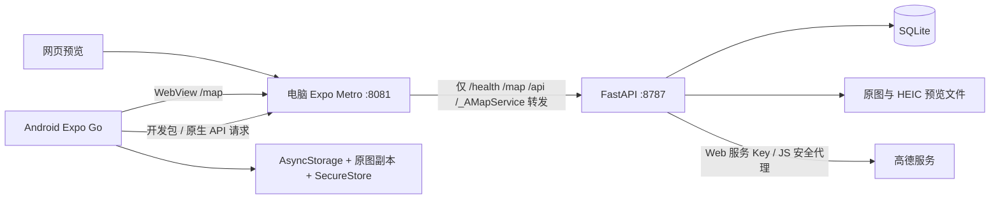

# OwlTrace · 鹰迹

用地图留住旅途里的照片和文字。手机端位于 `app/`，采用 Expo / React Native；后端位于 `api/`，采用 Python FastAPI。产品支持在地图上选点、拍照或导入原图、写笔记，以及公开分享、地图足迹、好友和文字消息。

本文更新于 **2026-10-09，调试版本 10.09-1**，记录当前实际实现。当前重点是 Android Expo Go 局域网体验；网页用于辅助预览。手机与服务器双份保存已实现，手机端服务器备份仍需真机验证网络兼容修复。

## 目录

- [运行与扫码](#运行与扫码)
- [已有功能与交互设计](#已有功能与交互设计)
- [架构与目录结构](#架构与目录结构)
- [高德地图与地址搜索](#高德地图与地址搜索)
- [照片、位置与坐标](#照片位置与坐标)
- [数据存储与同步设计](#数据存储与同步设计)
- [后端接口](#后端接口)
- [无法连接服务器的调查](#无法连接服务器的调查)
- [已知问题与实现边界](#已知问题与实现边界)
- [验证与维护](#验证与维护)

## 运行与扫码

### 环境

| 项目 | 当前选择 |
| --- | --- |
| Node.js | 22.13 或更高，使用 npm；前端依赖锁定于 `app/package-lock.json` |
| Python | 推荐 3.12，后端使用 `api/.venv` 虚拟环境 |
| 手机框架 | Expo `~57.0.27`、React `19.2.3`、React Native `0.86.3` |
| 手机调试 | 支持 SDK 57 的 Android Expo Go，手机和电脑处于可互访的局域网 |
| 后端 | FastAPI `0.142.4`、Uvicorn `0.54.0`、SQLite |
| 图片 | 客户端 exifr，后端 Pillow / pillow-heif，原文件保留 |

Expo SDK 对 Node、React Native 和 React 的版本有配套要求，参见 [SDK 57 版本表](https://docs.expo.dev/versions/v57.0.0/)。不要单独升级 React Native。

### 新电脑首次安装

以下示例针对 Windows PowerShell，当前电脑项目目录为 `D:\workspace\oriowl`。已有配置的电脑跳过复制 `.env`，避免覆盖已填写的 Key。

```powershell
cd D:\workspace\oriowl
npm --prefix app ci
python -m venv api/.venv
api/.venv/Scripts/python.exe -m pip install -r api/requirements.txt
Copy-Item api/.env.example api/.env
```

在 `api/.env` 填写自己的高德凭据；不要将凭据提交到 Git：

```dotenv
AMAP_JS_KEY=你的Web端JSAPI_Key
AMAP_SECURITY_JS_CODE=对应的securityJsCode
AMAP_WEB_KEY=你的Web服务API_Key
PORT=8787
```

`AMAP_JS_KEY` 与 `AMAP_SECURITY_JS_CODE` 是同一个 Web 端 JSAPI Key 的配置；`AMAP_WEB_KEY` 要单独申请「Web 服务」类型。未配置高德时，账号和笔记 API 仍可工作，地图与地址服务会提示待配置。

### 启动

```powershell
npm run dev
```

启动脚本会检查并启动或复用本项目的 FastAPI（8787）与 Expo Metro（8081），拒绝复用其他项目的服务。终端显示二维码，同时生成 `app/scan-to-open.png`。二维码不入库。

Android 安装 [Expo Go SDK 57](https://expo.dev/go?sdkVersion=57&platform=android&device=true)，与电脑连接同一可互访网络，然后扫码。当前电脑地址是 `192.168.31.138`，二维码对应 `exp://192.168.31.138:8081`；换网络后以重新生成的二维码为准。

首次体验：允许位置权限并打开手机定位；进入「我的」创建账号；到「探索」选地点或者导入带 GPS 的照片，填写笔记并发布。照片和正文都可独立使用，但笔记必须有地点。两个设备使用不同账号可体验好友和消息。

网页预览：`http://localhost:8081/`。FastAPI 的完整交互文档：`http://localhost:8787/docs`。网页和手机的本地缓存互相独立。

可以分开运行服务：

```powershell
# 终端一：项目根目录
api/.venv/Scripts/python.exe api/run.py
# 终端二：项目根目录
npm --prefix app start
# 重新生成二维码
npm run qr
```

Linux / macOS 创建虚拟环境的方式相同，Python 可执行文件改为 `api/.venv/bin/python`；根目录启动脚本会按平台选择虚拟环境路径。

### 服务地址规则

- 默认从 Expo 扫码地址、manifest 和 `extra.devApiUrl` 推断电脑地址。手机上的 `localhost` 指手机自身。
- Android 开发时，保存过的局域网开发地址（8081 或 8787）会直接切换到当前扫码电脑的 8081 网关，不等待失效地址响应。
- 同一电脑的 8787 → 8081 迁移，临时断网也保留原登录和待备份记录；401 不会被当作断网。不同电脑须先验证原凭证，原笔记索引仍保留。
- 保存过的 HTTPS 服务或其他自定义端口不被自动覆盖。「我的 → 服务设置」可以手动检测、保存地址或使用扫码电脑地址。
- `app/.env` 可配置 `EXPO_PUBLIC_API_URL` 指向手机可访问的后端。所有 `EXPO_PUBLIC_*` 都会进入客户端包，不能放密钥。
- 当前开发网关固定转发到本机 **8787**。如果修改后端 `PORT`，须同时调整 `app/scripts/apiGateway.cjs` / `scripts/dev.mjs`，或者手机直接连接新端口；仅改 `.env` 不能让网关自动跟随。
- `expo start --tunnel` 只解决开发包访问；使用独立服务或隧道还须保证后端地址可访问。

## 已有功能与交互设计

界面使用浅色薄荷背景、青绿色主按钮、卡片和圆角图片；品牌名为 **OwlTrace · 鹰迹**，地图与旅行照片是界面主体。Logo 位于 `app/assets/owltrace-mark.png`，素材来源和编辑记录见 [品牌说明](app/assets/BRAND.md)。独立安装包的系统图标需要重新构建；Expo Go 可展示项目名称和应用内 Logo。

底部采用五个主要入口：

| 页面 | 已实现 |
| --- | --- |
| 探索 | 打开后请求当前位置；当前位置标记、回到当前位置按钮；点地图选地点；地址/POI 搜索与输入联想；从地点进入发布页 |
| 地图足迹 | 世界轮廓、笔记地点和照片拍摄地点节点；拖动、缩放、点节点预览并打开笔记；底部地点列表 |
| 社交 | 公开笔记列表，分页、下拉刷新、详情；点击地点跳转探索地图；私密笔记不进入公开列表 |
| 消息 | 按账号/昵称搜索用户，发送与接受好友申请；会话、未读数、双向文字聊天；打开页面期间每 5 秒轮询 |
| 我的 | 注册/登录/退出、个人笔记、同步状态、恢复副本、清理副本、旧版导入、回收站和服务诊断 |

发布页默认入口为「添加原图」，另提供拍照，最多 9 张照片。Android 使用应用内的相机原图选择页，只列出授权的 `DCIM/Camera` 目录中的图片，不提供其他目录导航；视频、文档、子文件夹和改了图片后缀的普通文本均被过滤。标题可选，空标题取正文第一行或「旅行的片刻」；正文最多 5000 字，分类为风景/城市/美食/日常。新笔记默认公开，可在发布前选私密。

每次新导入照片后，笔记位置立即采用本次所选照片中第一张带 GPS 的拍摄地点，无需等服务器。多张照片可点各自的地点切换，当前照片标记为「已用于笔记位置」。移除该照片后改用剩余照片的地点，全部移除后退回进入页面时的地点或当前位置，不保留已移除照片的坐标。地址在后台逆地理编码并补充，较晚返回的旧地址不能覆盖新照片地点。手动搜索或选择当前位置可覆盖当前照片地点；再次导入带 GPS 的照片会重新自动采用拍摄地点。没有 GPS 也没有地点时，发布按钮上方显示校验提示，并保留草稿。

发布先写入手机并进入详情页，然后同步服务器。界面显示「已存手机，等待服务器备份」或已同步状态；网络异常不会阻塞本地发布、收藏和删除。详情支持收藏自己的笔记、查看照片、查看地点和删除。删除移入回收站，可恢复。

按钮视觉区域与触摸区域一致；主要发布按钮采用 `TouchableOpacity`、完整宽度和至少 56 高度。图标按钮至少 48，提供额外触摸边距；发布页保留键盘打开时的点击响应，并防止重复提交。

## 架构与目录结构



手机只需访问已经承载 Expo 开发包的 8081；Metro 中间件把指定 API 和地图路径转发给 `127.0.0.1:8787`。转发保留方法、Authorization、查询参数和上传字节，其他请求交回 Metro。后端未启动时返回明确的 JSON 503。此网关仅用于开发。

Android / iOS 的业务 API 通过 React Native 的 `XMLHttpRequest` 通道发送，避免 SDK 57 默认 `expo/fetch` 与旧 URI 表单的不兼容；Web 通过浏览器 fetch。平台文件由 Metro 选择。诊断页面另行对照默认 fetch，正常业务不会重复发送注册、上传或删除请求。

地图使用高德 JS API 2.0：原生端嵌入 WebView，Web 端嵌入 iframe。地图页由后端提供 HTML 和 JS。App 发送定位、选点、足迹等命令；地图回传 ready、selected、located、entry、error 等消息。定位请求带序号，过期结果被忽略，较晚的定位不会覆盖用户刚选的地点。

```text
oriowl/
├─ README.md
├─ package.json                 # 联合启动、二维码、统一检查
├─ scripts/
│  ├─ dev.mjs / python.mjs       # 服务检测和启动
│  ├─ check-api.mjs              # Python 后端测试入口
│  ├─ load-typescript.mjs        # Node 测试加载 TypeScript
│  └─ test-*.mjs                # 地图、照片、同步、原生分支、网络测试
├─ app/
│  ├─ app.json / app.config.js   # 品牌、权限、扫码电脑地址
│  ├─ metro.config.js
│  ├─ scripts/apiGateway.cjs     # 开发 API 网关
│  ├─ scripts/qr.mjs
│  ├─ assets/                   # 品牌图片
│  └─ src/
│     ├─ app/                   # Expo Router 页面及布局
│     ├─ context/               # 配置、认证、旅行状态
│     ├─ components/            # 地图、搜索、笔记、账号、同步、回收站
│     ├─ ui/                    # 按钮、弹窗、主题、页面容器
│     └─ lib/                   # API、平台网络、GPS、照片、本地存储与同步
└─ api/
   ├─ .env.example / requirements.txt / run.py
   ├─ owltrace/
   │  ├─ main.py / config.py / db.py / schema.sql
   │  ├─ auth.py / models.py
   │  ├─ maps.py / amap.py
   │  ├─ media.py / photo_metadata.py
   │  └─ notes.py / friends.py / messages.py
   ├─ templates/map.html / map.js
   ├─ tests/
   └─ data/                    # 运行生成，不入库
```

前端 provider 顺序负责先取得配置、恢复认证，再读取当前账号笔记与地图状态。业务 hooks 放在 `lib/`，页面只组合交互与视图；原生与 Web 的照片、下载、凭证存储使用不同平台文件。

## 高德地图与地址搜索

高德提供地址解析、POI 查询、输入联想和坐标转换，项目均由 FastAPI 代理调用：

| 功能 | 高德接口 | 本项目入口 |
| --- | --- | --- |
| 地址转坐标 / 回查地址 | [地理和逆地理编码](https://lbs.amap.com/api/webservice/guide/api/georegeo)，`v3/geocode/geo` / `regeo` | `/api/places/search`、`/api/places/reverse` |
| 地点与附近搜索 | [POI 查询](https://lbs.amap.com/api/webservice/guide/api-advanced/search)，`v3/place/text` / `around` | `/api/places/search` |
| 输入联想 | [输入提示](https://lbs.amap.com/api/webservice/guide/api-advanced/inputtips)，`v3/assistant/inputtips` | `/api/places/suggest` |
| WGS84 → GCJ-02 | [坐标转换](https://lbs.amap.com/api/webservice/guide/api/convert)，`v3/assistant/coordinate/convert` | `/api/coordinates/convert` |
| 世界足迹底图 | [DistrictLayer.World](https://lbs.amap.com/api/javascript-api-v2/guide/layers/districtlayer) | `/map?mode=footprints` |

输入至少两个字符后，450ms 防抖请求联想；完整搜索合并地理编码、POI 与附近查询，过滤无坐标结果并去重，最多返回 20 项。有当前位置时按直线距离升序，距离原点保持为当前位置，而不是最近选中的地点。某一上游查询失败时尽量保留其他可用结果并提示部分失败。

后端每次请求读取 `api/.env`；环境变量优先于文件。同一台电脑改 Key 后刷新即可；修改监听端口仍需重启进程。`/health` 的配置布尔值只检查凭据格式，不能证明高德权限或额度有效，真实调用结果才是依据。

JSAPI Key 是地图加载需要的公开标识，会出现在 `/map/config`；JS 安全密钥和 Web 服务 Key 留在后端。地图按 [高德安全代理方式](https://lbs.amap.com/api/javascript-api-v2/guide/abc/jscode) 使用 `/_AMapService/`，代理限制路径和回调格式、替换客户端传来的凭据，拒绝上游重定向，并遮蔽安全密钥。

当前世界足迹使用行政区轮廓；海外详细道路另需 [高德世界地图权限](https://lbs.amap.com/api/javascript-api-v2/guide/map/world-map)。中国以外的地址搜索范围也受高德数据覆盖限制。

## 照片、位置与坐标

### 导入链路

1. Android 首次导入通过 SAF 授权 `DCIM/Camera`，选错目录直接拒绝；随后从固定目录的应用内图片网格选择。目录 URI 和直属文件路径均检查，读取最多 64 字节签名过滤非图片，不遍历子目录。仅支持本地外部存储提供方，含符合相同路径规则的 SD 卡目录。
2. 所选文件逐字节复制到应用缓存，再发布到应用文档目录，不压缩、裁剪、转码或移除 EXIF。拍照入口请求 EXIF，系统允许时额外查询媒体库位置。Web / iOS 继续使用系统原文件选择器并限制支持的图片类型，但无法按 Android 的规则强制固定目录。
3. 客户端直接解析原图 GPS 和拍摄时间，读取不依赖服务器。exifr 使用适合 Hermes 的解析模块，避开浏览器方向检测；PNG 另处理原始 eXIf 数据。
4. 导入过程只做本地读取；发布持久化完成后通过后台同步上传原图，后端用 Pillow / pillow-heif 再解析。支持有效 JPG、PNG、WebP、HEIC；单张上限 30MB。
5. 后端保留原图，不用预览替换原图。HEIC 需要预览时生成最大 1600 × 1600 的 JPEG；浏览器可缓存该预览。

`Photo.gps` 始终是原始 WGS84 经纬度；用于高德地图的 `Photo.place` / `Entry.place` 是 GCJ-02。优先通过高德坐标转换取得位置。断网时，客户端用 `coordtransform` 近似转换生成可发布地点，联网备份后以服务端转换结果校正；境外坐标按本地库的适用范围保持原值。

照片 GPS、笔记地点和当前位置是不同数据：手动选择笔记地点不会改写原图 GPS，照片地点与笔记地点都可成为地图足迹节点。逆地理编码失败时保留坐标，不伪造地址。

### Android 权限边界

小米相册里有地点，不代表选出的文件一定带 GPS。地点可能只存在相册数据库，也可能在文件选择过程中被系统隐藏。10.09-1 默认导入相机原文件；首次点击「添加原图」后，在系统授权页面进入 `DCIM/Camera` 并选择「使用此文件夹」。授权页仍是 Android 的系统界面，系统允许导航，但应用会拒绝其他目录；实际照片选择页完全由应用控制，不展示其他文件夹。目录访问被撤销后会重新请求授权。

目录授权采用 [Expo SAF API](https://docs.expo.dev/versions/v57.0.0/sdk/filesystem-legacy/)；Android 的初始目录参数是导航起点，不是锁目录机制，参见 [Android 文件与目录访问说明](https://developer.android.com/training/data-storage/shared/documents-files)。因此本项目通过授权结果校验及自建照片网格落实目录限制，没有把系统弹窗误称为已锁定目录。

Expo Go 的原生权限由其安装包决定，本项目 `app.json` 不能给已安装 Expo Go 增加权限。项目已通过 `expo-media-library` 插件配置独立构建的 `ACCESS_MEDIA_LOCATION`；需要完整系统媒体库能力时应制作开发构建。可参考 [Expo 开发构建](https://docs.expo.dev/develop/development-builds/introduction/)。

没有有效 GPS 时明确显示未取得拍摄坐标，并保留照片供手动选点。聊天软件转发、截图和相机关闭位置保存等情况通常不能恢复原始拍摄地点。EXIF 没有时区时，拍摄时间也不能保证代表拍摄地的准确时区。

## 数据存储与同步设计

### 存储位置

| 数据 | 手机 | Web | 服务器 |
| --- | --- | --- | --- |
| 笔记索引 | AsyncStorage，以服务地址 + 用户 ID 隔离 | AsyncStorage Web 存储 | SQLite `notes` |
| 原图 | 应用文档目录的独立副本 | IndexedDB | `data/uploads/` |
| 登录信息 | SecureStore | AsyncStorage Web 存储 | `sessions` 仅存 token 哈希 |
| 好友和消息 | 从接口读取 | 从接口读取 | SQLite |
| 回收站 | 索引中的删除状态 | 同左 | 原记录 + `note_deletions` |

默认数据库是 `api/data/owltrace.sqlite3`。数据库使用 WAL、外键检查和连接提交；启动时根据 `schema.sql` 创建表。可在进程环境变量 `OWLTRACE_DATA_DIR` 中设置另一个绝对数据目录，这不是 `read_config()` 中的 `.env` 字段。

主要表：`users`（用户名唯一、密码哈希）、`sessions`（token_hash、过期时间）、`media`（所有者、原图名、JSON 元数据）、`notes`（地点和照片 ID 列表为 JSON）、`note_deletions`（删除标记）、`friend_requests`（申请状态）、`friends`（有序用户对）、`messages`（发送者、接收者、正文、已读时间）。

密码采用随机盐 + PBKDF2-HMAC-SHA256，600,000 次迭代，比较使用恒定时间方法。会话 token 随机生成，数据库保存 SHA256 摘要，有效期 30 天；退出撤销当前 token。用户名 3–24 位英文字母/数字/下划线，密码 8–128 位。原生凭证不会以明文写入笔记索引。

### 发布与同步

```text
草稿 → 校验地点/内容 → 复制原图到应用目录 → 写入本地索引
     → 展示本地详情（pending） → 后台上传照片 → PUT 笔记
     → 服务端保存成功（synced）
                 ↘ 失败（error），保留本地副本，后续继续同步
```

同步在打开应用、回到前台、前台每 30 秒、手动同步和本地操作后触发。同一账号只运行一个同步任务；网络请求不占用本地写入队列。同步完成时合并快照与最新本地状态，避免把同步期间新发布、删除、恢复的记录覆盖回旧状态。

同步先探测健康接口，处理待备份记录与删除/恢复状态，随后获取服务器的个人笔记和回收站，补回缺失原图。上传成功的照片 ID 会保留，降低下次重试重复上传的概率；没有服务器确认的照片不会被当作已备份。客户端记录 `locationPhotoIndex`，按用户选中的照片校正地点，避免同步后又切回第一张照片；手动地点不被自动照片地址替换。

删除先设置本地 `deletedAt`，页面立刻隐藏，再发 DELETE。服务器保留原记录和原图、建立删除标记；后续迟到的 PUT 返回 410，避免恢复成公开笔记。回收站恢复先清除服务端删除标记，再同步内容。删除后的公开照片不再对访客开放。

清除本地副本只操作应用目录与当前账号索引，不动手机系统相册和服务器。存在待同步或没有服务器备份的删除记录时拒绝清除；未上传就删除的笔记须先从回收站恢复并备份。清除后再次同步可恢复已经上传的内容。

旧版数据保留在原位置，用户在「我的」主动选择导入时迁移为私密笔记。服务地址迁移也保留旧索引，防止地址切换丢失离线记录。

### 访问权限与备份

- 笔记写入、删除、恢复、照片上传和个人列表要求有效会话，并检查资源所有者。
- 公开笔记可匿名查看，照片在被有效公开笔记引用时可公开获取；私密和未发布照片仅作者可取。无法访问时返回 404。
- 好友确认后才能聊天，消息内容限制为 1–2000 字；读取会话消息可更新已读状态。
- 服务器当前就是开发电脑。备份时先停止 FastAPI，再复制**整个 `api/data/`**，不要只复制 SQLite 主文件而遗漏 WAL 或原图。
- 卸载 Expo Go 或清除应用数据会删除仅在手机上的内容；已经上传的记录可连接原服务器、登录原账号后恢复。Git 不是用户数据备份。

## 后端接口

完整参数和响应模型以 FastAPI `/docs` / `/openapi.json` 为准。通过开发网关调用时仍使用以下路径。

| 方法 | 路径 | 用途 / 认证 |
| --- | --- | --- |
| GET | `/health` | 运行标识、FastAPI 类型、地图配置状态；匿名 |
| GET | `/map`、`/map/script.js`、`/map/config` | 地图页面、脚本和公开 JS Key |
| GET | `/_AMapService/{path}` | 高德 JSAPI 安全代理 |
| GET | `/api/places/search`、`/api/places/suggest` | q、可选 city、当前位置经纬度；匿名 |
| GET | `/api/places/reverse`、`/api/coordinates/convert` | 经纬度对应地址 / GPS 坐标转换；匿名 |
| POST | `/api/auth/register`、`/api/auth/login` | JSON username/password/nickname，返回 token 与 user |
| GET / POST | `/api/auth/me` / `/api/auth/logout` | 当前用户 / 撤销当前会话 |
| POST | `/api/photos` | 登录；multipart file + 可选 GPS JSON，返回照片 ID 和元数据 |
| GET | `/api/media/{id}`、`/api/media/{id}/preview` | 原图 / 预览，按公开引用和所有者鉴权 |
| GET | `/api/notes/mine`、`/api/notes/trash` | 登录；个人记录 / 回收站 |
| GET | `/api/notes/feed` | 匿名；before 时间游标，limit 默认 20、最大 50 |
| GET | `/api/notes/{id}` | 公开笔记或当前作者的私密笔记 |
| PUT | `/api/notes/{id}` | 登录；创建或更新自己的笔记 |
| DELETE | `/api/notes/{id}` | 登录；软删除，返回 deleted 和 hasBackup |
| POST | `/api/notes/{id}/restore` | 登录；恢复删除状态 |
| GET | `/api/users?q=…` | 登录；搜索用户 |
| GET | `/api/friends`、`/api/friends/requests` | 登录；好友 / 待处理申请 |
| POST | `/api/friends/requests` | 登录；以 userId 申请好友 |
| POST | `/api/friends/requests/{id}/accept` | 登录；接收方确认 |
| GET | `/api/conversations` | 登录；会话与未读数 |
| GET / POST | `/api/messages/{peer_id}` | 登录且为好友；分页读取 / 发送文字 |

PUT 笔记的主要字段为 `title`、`body`、`place`、`photoIds`、`category`、`visibility`、`favorite`。`place` 包含 longitude、latitude、name、address、可选 city。照片先上传，再引用服务端照片 ID；不能引用其他用户的照片。

常见错误：400 输入或图片无效；401 会话失效；403 所有者/好友权限不符；404 无资源或不可见；409 用户名重复；410 笔记已删除；413 图片超限；422 模型校验失败；502 高德上游失败；503 地图未配置或开发网关后端未启动。HTTP 错误、非 JSON 响应、发送前异常和读取响应异常分别显示。

当前请求超时：通常 20 秒；同步健康检测 4 秒，删除/恢复/个人列表 10 秒，上传 90 秒，原图下载 60 秒；搜索 15 秒。FastAPI 高德调用 12 秒。超时不会自动重放写请求。

## 无法连接服务器的调查

### 已有证据

1. 用户在手机浏览器访问 `http://192.168.31.138:8081/health`，返回 `ok: true`，证明该地址至少可从手机浏览器访问。
2. 用户确认手机加载了 10.08-2；最新截图的错误地址已是 8081，照片 GPS 正确、本地笔记可发布。这排除了「只有旧端口未更新」和「发布必须等待 GPS 接口」作为全部解释。
3. 旧 `request()` 将所有非 HTTP 异常替换为同一条「无法连接」提示。文件表单序列化、原生模块异常和响应读取错误也会被误报为 Wi-Fi 问题；旧截图无法据此确定真实原因。
4. **发现并复现兼容性缺陷**：SDK 57 原生全局 fetch 已切换为 `expo/fetch`。其 `convertFormDataAsync()` 不支持 React Native 的 `{uri, name, type}` 文件字段，会抛出 `Unsupported FormDataPart implementation`，请求尚未发往服务器。回归测试直接执行当前已安装 Expo 源码，能够复现。
5. 第 4 项解释照片上传失败，但它本身不能解释不含照片的 `/health` 也失败。真机默认 fetch 的模块、连接或响应流是否另有异常，尚需诊断结果，不能把表单问题认定为全部根因。

官方依据：[Expo SDK 57 全局 fetch 说明](https://docs.expo.dev/versions/v57.0.0/sdk/expo/)、[React Native 网络与 XMLHttpRequest](https://reactnative.dev/docs/0.86/network)。项目复现见 `scripts/test-network.mjs`。

### 10.08-3 的修复与诊断

- 原生业务请求明确走 XHR，可兼容原图 URI 表单，绕开默认 Expo fetch 的序列化和响应流实现；网页继续使用 fetch。地址搜索也统一走该 API 通道。
- 保留底层错误名称/原因、接口路径、请求通道、发送或读取响应阶段、已收到的 HTTP 状态；遮蔽错误中的 Bearer token 和 URL 查询参数。
- 「我的 → 服务设置 → 运行连接诊断」并行、只读检测：应用 XHR `/health`、默认 fetch `/health`、应用 `/api/notes/feed`。不上传照片、不发送凭证、不清除数据。
- 开发网关仅记录显式诊断请求的通道、路径、状态和来源 IP；不记录 token、完整查询、笔记、密码或照片。日志示例：`[OwlTrace diagnostic] xhr GET /health -> 200 from …`。
- 已检查当前扫码服务提供的真实 Android bundle，确认包含 XHR 实现和 10.08-3 标记；不能只以网页或 Node 测试成功代表真机通过。

| 手机诊断结果 | 下一步判断 |
| --- | --- |
| XHR 健康与笔记接口成功，默认 fetch 失败 | 默认 Expo fetch 通道有异常，业务已绕开；保留默认 fetch 的原始错误进一步定位 |
| 三项都成功，但备份失败 | 看具体 `/api/photos` 或 `/api/notes` 错误，检查会话、图片、HTTP 状态和后端异常 |
| XHR 与 fetch 都失败，手机浏览器健康成功 | 比较原始错误及电脑诊断日志；排查 Expo Go 的网络权限、系统按应用网络限制、VPN/代理或原生运行时；尚不能只认定为防火墙 |
| 收到 HTTP 503 | 手机请求已到达网关；检查 FastAPI 是否启动，不应继续当作手机 Wi-Fi 失败 |
| HTTP 200 但不是 JSON / 接口格式错误 | 请求抵达了其他页面/服务，检查地址和网关路径 |

重新加载 Expo Go，确认当前版本 10.09-1（保留 10.08-3 的网络修复），先运行诊断，再点「同步 / 从服务器恢复」观察既有笔记是否备份成功。不需要重建账号、清除 Expo Go 数据或重新导入照片。当前没有远程控制实体手机的能力，修复是否解决该手机的健康请求与实际备份**仍待真机回报**。

## 已知问题与实现边界

| 状态 | 问题 / 边界 | 影响与后续方向 |
| --- | --- | --- |
| 待真机验证 | 10.08-2 默认网络失败，10.08-3 已替换通道 | 手机浏览器连通不足以证明 App API 可用；按上节诊断记录真实错误 |
| 已修复并回归 | EXIF 库导入时读取不存在的 navigator.userAgent | 使用解析模块，避免 Hermes 启动崩溃 |
| 已修复并回归 | 有 GPS 但转换接口离线导致发布不动 | 本地坐标转换生成地点，本地先发布，网络恢复后校正 |
| 已修复并回归 | 网络同步占用本地写队列 / 迟到快照覆盖删除 | 网络与本地队列分离，合并保留并发改动，服务端删除标记阻止迟到 PUT |
| 已调整，仍需不同机型体验 | 按钮触摸区域、键盘遮挡、相册权限 | 扩大触摸范围、发布按钮使用原生触摸组件；系统权限差异仍依赖真机 |
| 能力边界 | 完整 Android 媒体库定位不是 Expo Go 全权限能力 | 文件原图可用时优先导入；完整权限需要开发构建 |
| 待真机验证 | 10.09-1 原图目录授权与固定图片网格 | 自动测试验证拒绝错误目录、字节保留及即时坐标；各厂商的系统授权页面和 SAF 读图能力仍需实机验证 |
| 导入边界 | 固定 `DCIM/Camera`，不会证明文件一定未经外部编辑 | 其他目录的照片须先放入此目录；复制保留现有 EXIF，不能补造原文件已经丢失的 GPS |
| 格式边界 | 不同 HEIC/WebP 编码、厂商 EXIF 和拍摄时区 | 后端可解析多种格式，但不能保证所有厂商文件；客户端无 GPS 时允许手动选点 |
| 同步边界 | 多设备同时改同一笔记没有 revision/冲突解决 | 服务端最后写入生效；本地并发保护不等于跨设备冲突协议 |
| 同步边界 | 下载个人数据为全量列表，原图串行补回 | 大相册首次恢复耗时；后续考虑增量游标、并发限流和缩略图优先 |
| 同步边界 | 自动重试在应用前台，没有操作系统后台任务 | 杀掉 App 后不会持续备份，需要重新打开；网络错误保留待同步记录 |
| 草稿边界 | 未发布草稿仅在页面内存 | 退出页面有确认，但杀进程后草稿不能保证恢复；发布后的记录已持久化 |
| 存储边界 | 回收站软删除长期保留，未引用上传照片没有自动清理 | 服务器空间会增长；尚无永久删除、过期回收或内容哈希去重 |
| 账号边界 | 只有账号密码登录，没有找回密码/邮箱验证 | 凭证过期须重新登录；不提供管理端和用户生命周期工具 |
| 社交边界 | 只有公开笔记、好友申请与文字消息 | 没有评论、点赞体系、群聊、消息推送、屏蔽举报和内容审核后台 |
| 地图边界 | 高德覆盖、Key 权限、额度与服务可用性 | 海外地址和道路不保证完整；有坐标时保留位置并显示地址暂不可用 |
| 部署边界 | 目前使用开发电脑、HTTP、宽松开发 CORS | 无生产 HTTPS、持久对象存储、限流与监控部署；上线前需要独立部署方案 |
| 配置边界 | 服务地址作为本地索引命名空间 | 非自动识别的地址变化可能显示另一个本地索引；保留旧配置和数据，谨慎迁移 |
| 验证边界 | Android 主目标，iOS 尚未实际设备测试 | 通用代码和平台分支存在，但不宣称 iOS 体验已验证 |

公开照片使用原始文件，可能包含 GPS/EXIF；目前没有公开分享时自动去除敏感元数据的单独预览策略。这是现有设计的实际边界，适合在正式产品阶段提供明确选项。

## 验证与维护

```powershell
# 项目根目录：类型、lint、后端与客户端回归
npm run check
# app 目录：检查 Expo 配套依赖
cd app
npx expo-doctor
# 生成 Android Hermes 包，验证打包兼容性
npx expo export --platform android --output-dir dist/android
```

统一检查包含：

| 检查 | 覆盖 |
| --- | --- |
| TypeScript / ESLint | 前端类型、hooks 与代码检查 |
| Python unittest（11 项） | 地图配置不泄密、代理限制、地址查询/坐标转换、原图与 EXIF、私密鉴权、删除恢复与重启、好友/消息/退出 |
| 地图脚本（4 项） | 坐标转换、当前位置命名、晚到定位保护、过期请求、世界节点跳转 |
| 手机基础（4 项） | JPEG/PNG 原始 EXIF、无 userAgent 的加载、LAN 地址推断、网关字节与凭证透传 |
| 同步（5 项） | 快照并发合并、扫码地址迁移、GPS 离线地点、HTTP 与非 JSON 错误分类 |
| 原生发布分支（5 项） | 原图网格选择与实际文件复制、后台网络挂起仍发布、即时照片地点与旧地址保护、切换/移除地点照片、无 GPS 校验、离线迁移 |
| 网络（4 项） | 执行 Expo 源码复现 URI 表单失败、XHR 绕开坏 fetch、取消与迟到响应、原始异常与遮蔽 |
| 原图限制（5 项） | 目录/直属路径限制、字节签名、错目录拒绝、非图片/目录/重复项过滤、同步保留所选照片地点 |

合计 38 项行为测试。原生分支测试替换原生适配器并使用真实测试图片字节与磁盘复制；它们不是实体 Android 网络/触摸测试。后端高德查询测试使用可控上游，不代表当前 Key 的在线额度。Android 导出成功也不是实际手机联网成功。

修改 `metro.config.js` 或网关中间件后须重启 Metro；普通前端变更可重新加载。清 Metro 缓存使用 `npx expo start --lan --clear --port 8081`，不需要清手机用户数据。安装 Expo 模块使用 `npx expo install`，保持 SDK 配套版本。

代码仓库应包含前后端源码、依赖锁、品牌素材、测试图片和示例配置；`.env*`（示例除外）、虚拟环境、node_modules、构建输出、二维码、日志、`.local/` 与 `api/data/` 被忽略。测试使用临时独立数据目录，不修改实际用户相册。

后续优先顺序：完成真机网络诊断与备份验证 → 开发构建验证小米完整照片权限 → 持久草稿和跨设备同步冲突协议 → 原图存储/缩略图策略与部署 → 更完整的社交与账号功能。
